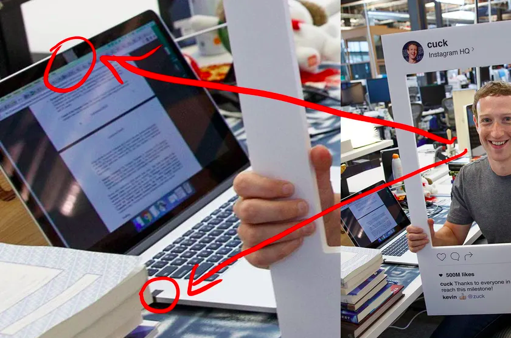
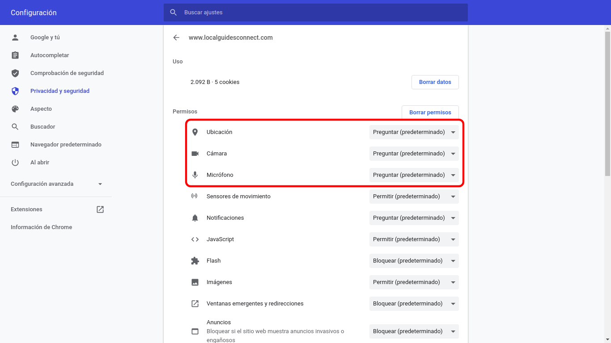
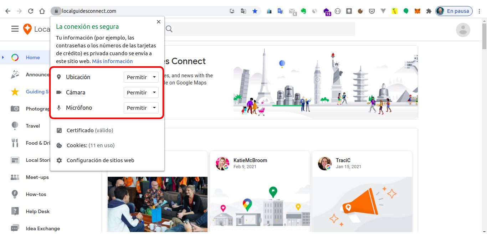

# Gestión de la privacidad

## Gestionar la privacidad

La privacidad en Internet se refiere al control de la información personal que posee un determinado usuario que se conecta a Internet, interactuando por medio de diversos servicios en línea con los que intercambia datos durante la navegación. Por ello, en esta unidad vas a lograr aprender a gestionar la privacidad de manera inteligente, para así evitar males mayores que podrían hacer de tu vida privada un terreno en el que seguro, no te gustará estar [@WIKI-privacidad].

## Datos personales sensibles

Cuando se habla de datos personales sensibles en la red, se refiere a aquellos datos que están revelando información privada, como por ejemplo, el domicilio o cualquier otra información de carácter privado, costumbres o hábitos. Así como acciones que ubican o determinan a una persona en posibles situaciones futuras que pudiesen abrir una brecha de vulnerabilidad en la vida privada de ésta. Un ejemplo sería subir a la red que te vas de vacaciones, de manera que estás diciendo a los ciberdelincuentes que tu casa estará vacía.

Entrando en un terreno más técnico los datos sensibles son aquellos que, de difundirse indebidamente podrían afectar la esfera más íntima del ser humano. Ejemplos de este tipo de datos son: el origen racial o étnico, el estado de salud, la información genética, las creencias religiosas, filosóficas y morales, la afiliación sindical, las opiniones políticas y las preferencias sexuales.

Por ello, aporta solo los datos necesarios y no te expongas.

## Oversharing o sobreexposición

El Oversharing es la sobreexposición de información personal en internet y en su mayoría en los Medios Sociales a través de tus perfiles sociales. Este hecho se presenta continuamente en la actualidad, donde los jóvenes y no tan jóvenes, publican constantemente imágenes o información personal. 

De esta manera, tu vida queda totalmente expuesta y aunque el propósito de ello sea totalmente lícito e incluso plausible, estos datos, imágenes o información pueden volverse en tu contra por un uso indebido o ilícito por parte de terceros.

Este exceso de información que se puede facilitar en internet, sumado al comportamiento malicioso de otros usuarios, supone un grave riesgo que se corre cada día al señalar tu ubicación, comentar información personal o privada, colgar una imagen o video comprometedores, etc.

Esto no supone un delito en cuestión, pero puede dar lugar al chantaje, ciberacoso o robo de información personal a través de algún tipo de técnica. Además de exponerte al riesgo de un posible robo y/o suplantación de identidad [@AEPD-oversharing].

## Privacidad en tus cuentas

Prácticamente todo el mundo en menor o mayor medida dispone de cuentas de usuarios en todas sus aplicaciones o servicios en la red. Una de las más conocidas es la cuenta de [Google](https://myaccount.google.com/data-and-personalization), así como también la de [Microsoft](https://account.microsoft.com/account/privacy) entre otras. En ambos enlaces podrás ajustar la privacidad con la que más cómodo te sientas. Además recuerda que no solo estos dos servicios disponen de estos ajustes, sino que también el resto de plataformas deben brindarte la posibilidad de que realices tu propia configuración.

En lo que respecta a las redes sociales como, [Facebook](https://es-la.facebook.com/help/325807937506242), [Twitter](https://help.twitter.com/es/safety-and-security#ads-and-data-privacy) o [Instagram](https://es-es.facebook.com/help/instagram/196883487377501/?helpref=hc_fnav&bc[0]=Ayuda%20de%20Instagram&bc[1]=Administrar%20tu%20cuenta), entre otras muchas más, no debes olvidar que también disponen opciones de privacidad y que en éste escenario está en juego tus datos más personales. Luego el mejor consejo es establecer una configuración privada en lugar de pública, ya que estas redes sociales no tienen por defecto, los niveles más elevados en cuanto a la protección y a la seguridad.

Con referencia a todo lo expuesto, puedes dejar la configuración de privacidad que la cuenta trae por defecto o acomodarla a tus necesidades o preferencias. Dentro de cada cuenta se encuentran todas las opciones de privacidad, como por ejemplo, historial de búsquedas, actividad de ubicación entre otras. 

## Navegación privada

La navegación privada es una función de privacidad que conocerás como modo incógnito o modo privado. Su principal característica es que permite a los navegadores web no almacenar información sobre la página en que navegamos.

La navegación privada te ofrece una sesión temporal que no comparte datos con el navegador, que no guarda información sobre páginas web, ni historial de navegación, caché web, contraseñas, información de formularios, cookies u otros datos de sitios web, borrando éstos y otros archivos temporales cuando finalices la sesión [@navegacion-privada].

```{r, echo=FALSE, out.width='75%', fig.align='center', fig.cap='Navegación privada navegador Google Chrome.'}
knitr::include_graphics('images/navegacion-privada.jpg')
```

Ten en cuenta que no es lo mismo navegar privadamente que navegar de forma anónima por Internet, lo que requiere de otras herramientas como [TOR](https://www.torproject.org/).

El uso de la navegación privada resulta conveniente en los siguientes supuestos:

- Transacciones económicas.
- Utilización de un ordenador de terceros.
- Obtención de resultados “puros” del motor de búsquedas.
 
También existen navegadores que protegen tu privacidad sin necesidad de activar la navegación privada, como por ejemplo, [Epic](https://www.epicbrowser.com/), [Brave](https://brave.com/es/) e incluso buscadores como [DuckDuckGo](https://duckduckgo.com/). 

## VPN (Red privada virtual)

Otra manera más de proteger tu privacidad, es hacer uso de una VPN (son las siglas de Virtual Private Network) [@AVAST-vpn].
  
Las VPN son una tecnología de red que permiten una extensión de tu conexión local o LAN, permitiendo conectar varios dispositivos como si se encontrasen físicamente en el mismo lugar. Entre sus ventajas está la de ofrecer una mayor privacidad al ocultar tu localización, pero también, y este el caso que nos compete, el que parezca que tu conexión esté realizándose en otro país concreto, con lo que uno se puede saltar censuras o acceder a contenidos de servicios locales. 

Su principal particularidad es que se trata de una conexión segura y cifrada. Esto hace que no sea posible conocer la información que viaja en la petición que se realiza, así como tampoco la IP pública que identifica tu dispositivo, ya que la conexión se realiza a través de los muchos router VPN en diferentes ubicaciones.

Las VPN suelen ser aplicaciones o extensiones de terceros, aunque el navegador [OPERA](https://www.opera.com/es) lo trae por defecto. Lo único que tendrás que hacer es activarla desde sus opciones, y se creará una conexión cifrada entre tu dispositivo y un servidor VPN para esconder tu ubicación real.

No obstante no todas las VPN son igual de eficaces y en ocasiones algunas de ellas pueden no estar funcionando todo lo bien que cabría de esperar y durante tu sesión de navegación podrían verse expuestos algunos de tus datos. Por suerte, existen herramientas como [What leaks?](https://whatleaks.com/) que te permite analizar la eficacia de tu VPN a la hora de proteger tu privacidad. 

## Cookies

Una cookie es un fichero que guarda nuestro navegador, donde se almacenan pequeñas cantidades de datos, de manera que el sitio web puede consultar la actividad previa del navegador.

Su propósito principal es identificar al usuario almacenando su historial de actividad de un sitio web específico, de manera que se le pueda ofrecer el contenido más apropiado según sus hábitos. Esto quiere decir que cada vez que visitas una página web por primera vez, se guarda una cookie en el navegador con un poco de información. Luego, cuando visitas nuevamente la misma página, el servidor pide la misma cookie para arreglar la configuración del sitio y hacer la visita del usuario tan personalizada como sea posible [@cookies-navegador].

Existe la opción de navegar sin cookies gracias a las sesiones privadas que tienen los distintos navegadores, como has podido ver en el apartado anterior. De esta forma no se almacenará ningún tipo de información en tu ordenador cuando navegues en una web y del mismo modo tampoco recordará nada después al volver a navegar de nuevo.

Es importante que con frecuencia elimines las cookies, ahora que sabes que manejan información privada y además ocupan espacio en tu dispositivo. Existen dos formas manuales de hacerlo. La primera de ellas es desde el menú de opciones del propio navegador y la otra es con un software específico para tal cometido, como por ejemplo [Ccleaner](https://www.ccleaner.com/es-es). Pero si quieres automatizar esta tarea, practicamente todos los navegadores disponen de una configuración para que una vez  cierres el navegador se realice una limpieza de manera automática. La siguiente imagen te muestra la opción que debes buscar en el navegador Google Chrome, para ello ve al Menu del navegador, entra en Configuracíón, luego Privacidad y seguridad, a continuación Cookies y finalmente Borrar las cookies y los datos de sitios al salir de Chrome, pero debes tener en cuenta que las ubicaciones pueden variar con las actualizaciones. Si usas otro navegador puede ser que varíe la ruta de acceso, pero a grandes rasgos suelen ser muy parecidas y también se acceden a ellas a través del menú de opciones.

```{r, echo=FALSE, out.width='75%', fig.align='center', fig.cap='Eliminar cookies automáticamente al cerrar Google Chrome.'}
knitr::include_graphics('images/borrado-cookies-cierre-navegador.png')
```

Por otro lado si quieres deshacerte de la incómoda notificación de cookies de las web, puedes instalar en el navegador el plugin [I don’t care about cookies](https://www.i-dont-care-about-cookies.eu/) o este otro [Ninja cookie](https://ninja-cookie.com/), elige el que más te guste.

Si quieres más información detallada sobre las cookies visita este enlace [por qué borrar las cookies](https://www.osi.es/es/actualidad/blog/2019/09/11/por-que-borrar-las-cookies-del-navegador) y este otro [tipos de cookies, cofiguración y consejos](https://www.osi.es/es/actualidad/blog/2018/07/18/entre-cookies-y-privacidad) de la Oficina de Seguridad del Internauta donde las analizan con más detalle. 

## Permisos cámara, micrófono y localización.

Una práctica muy saludable en el uso de la cámara o webCam e incluso el micrófono, es tenerla tapada cuando no la estés usando y si no fijate en la foto se muestra a continuación  que le tomaron a Mark Zuckerberg.

```{r, echo=FALSE, out.width='75%', fig.align='center', fig.cap='WebCam y micrófono del ordenador tapados.'}

```

Para tener el control total sobre las funcionalidades de cámara, micrófono y ubicación, debes establecer los permisos en la opción de Preguntar, lo verás más claramente en la imagen que se muestra más abajo. Para establecer estos parámetros existen dos maneras de hacerlo, uno de ellas es a través de la opciones que te da el menú de configuración del propio navegador, y para ello debes ir a  Menú navegador, buscar Configuracíón, después Privacidad y seguridad, a continuación Configuración de sitios web y finalmente Permisos y como ya se indicó en el caso de borrado de cookies automático, debes tener en cuenta que las ubicaciones pueden variar con las actualizaciones que reciba el navegador.

```{r, echo=FALSE, out.width='75%', fig.align='center', fig.cap='Ajustes permisos cámara, micrófono y ubicación desde el menú de opciones del navegador.'}

```

Aunque estos permisos son los más importantes cuando navegas por internet, si te fijas en la  figura 2.4 verás que no son los únicos  y que entre éstos se encuentran los de notificaciones o los de ventanas emergentes entre otros.

La otra forma es más sencilla e incluso te permite cambiar los permisos directamente desde el navegador sin tener que ir al menú de opciones y esto lo tienes haciendo click en el candado de la barra de direcciones. Se trata del mismo candado que nos acredita que estamos ante una web segura. Puedes verlo en la siguiente imagen.

```{r, echo=FALSE, out.width='75%', fig.align='center', fig.cap='Ajustes permisos cámara, micrófono y ubicación desde el candado de la barra de direcciones.'}

```

Para concluir, no debes olvidar que con las aplicaciones móviles sucede lo mismo, y que puedes gestionarlos de igual manera desde ajustes del dispositivo. Visita los siguientes enlaces dependiendo de tu smartphone, [cambiar los permisos de las aplicaciones en teléfonos Android](https://support.google.com/android/answer/9431959?hl=es) o [controlar el acceso a la información en las apps en el iPhone](https://support.apple.com/es-es/guide/iphone/iph251e92810/ios). En el siguiente enlace, [permisos aplicaciones  móviles](https://www.osi.es/sites/default/files/docs/c5-eg-permisos-apps-riesgos.pdf) encontrarás una tabla con los permisos y los riesgos que entrañan.

## La nube

Como ya sabrás el almacenamiento en la nube, es el almacenamiento de datos en servidores por lo general aportados por terceros y que gracias a esto, puedes disponer de ellos desde cualquier lugar y dispositivo, con solo tener conexión a internet y conectarte al servicio donde están alojados tus datos. De esta manera ya no es necesario llevar contigo el dispositivo físico donde tienes almacenada tu información. Algunos de estos servicios más conocidos son [Google drive](https://www.google.com/intl/en_in/drive/),[One drive](https://www.microsoft.com/en-us/microsoft-365/onedrive/online-cloud-storage) o [Dropbox](https://www.dropbox.com/) entre otros.

Antes de decidirte por cuál de los proveedor de servicio en la nube debes decantarte, ten en cuenta los siguientes:

- Donde va a estar ubicada tu información. Esto te permitirá conocer la legislación y
garantías de protección de tus datos en el país donde se encuentren.

- Saber si la plataforma comparte información con terceros o no.

- Si la web cuenta con certificado digital y es accesible mediante https.

- Mecanismos de cifrado, ya que éstos maximizan la seguridad de los datos.

- Políticas de privacidad.

De otro lado también puedes tomar tus propias medidas de seguridad cifrando tu datos antes de subirlos. Para ello puedes usar esta herramienta llamada  [cryptomator](https://cryptomator.org/).

En este enlace encontrarás un estudio completo de los diferentes [servicios de almacenamiento en la nube](https://www.osi.es/sites/default/files/docs/osi_servicios_nube.pdf) y sus características.

A la hora de compartir tus datos alojados en la nube debes tener en cuenta que solo es recomendable compartirlos con personas de confianza, ya que de lo contrario podrían hacer un mal uso de ello, o simplemente una mala gestión que provoque la pérdida de la información.

## Correo electrónico y apps de mensajería

El correo electrónico es uno de los servicios web que más se suele utilizar. Es por ello que debes saber que muchos de lo gestores de emails que son utilizados a diario, no aplican estrictas políticas de privacidad, por lo que tus correos podrías ser leídos y rastreados no solo por terceros con intenciones poco saludables sino también por éstos mismos servicios de correo.

Esto no tiene por que ser un inconveniente si no envías información sensible, pero si no es el caso quizá preferirías usar un gestor de correos que sí te garantice una privacidad completa en tus envíos. De ser este tu caso puedes usar  [Protonmail](https://protonmail.com/), [Tutanota](https://tutanota.com/es/) o [Fastmail](https://www.fastmail.com)que si tienen en cuenta este aspecto, aunque no son los únicos. En el siguiente enlace tienes una lista de otras [alternativas de emails privadas](https://blogthinkbig.com/alternativas-gratuitas-gmail-outlook-privacidad).

Si por el contrario prefieres ser tu quien gestiones esa capa de privacidad adicional, puedes optar por hacer uso de otras herramientas de encriptado que podrás ver en este artículo de [cómo encriptar y proteger tu correo electrónico](https://www.osi.es/es/actualidad/blog/2019/07/31/como-encriptar-y-proteger-tu-correo-electronico).

Si además quieres saber si tu cuenta de correo o tu número de teléfono han sido comprometidos, puedes saberlo a través de la siguiente plataforma [haveibeenpwned](https://haveibeenpwned.com/).

Con respecto a las aplicaciones de mensajería instantánea debes tener en cuenta que sucede lo mismo que con los correos electrónicos. A pesar que la mayoría de ellas, incluida la más popular de todas (whatsApp) disponen de capas de privacidad que la hacen confiable, a veces no podemos estar totalmente seguros de no estar sometidos a un seguimiento por parte de éstas. Es por ello que las aplicaciones como [telegram](https://telegram.org/) y [signal](https://signal.org/es/) nacen con el propósito de no inmiscuirse en el uso que haces de la aplicación.

## He decidido vender o donar mi dispositivo

Si estás pensando en vender o quizá donar cualquiera de tus dispisitivos, ya sea un disco duro externo, el ordenador o portátil, un USB o cualquier otro dispositivo que contenga almacenamiento, asegurate primero de eliminar totalmente todo el contenido. Para ello utiliza software de forrado definitivo, ya que un simple formateado no borrará la información. El borrado solo se completa cuando se reescribe sobre la anterior información, es por esto que un formatero solo te hace constar que el espacio esta disponible, pero el contenido, aunque oculto, sigue estando ahí. Esto que quiere decir que con software avanzado y específico los ciberdelicuentes podrían recuperar todo el contenido [@XATAKA-borrado-almacenamiento].

Si quieres más recomendaciones sobre como actuar en este supuesto, te recomiendo que leas la siguiente entrada [¿Sabías que 2 de cada 5 dispositivos vendidos contienen información personal?](https://www.osi.es/es/actualidad/blog/2019/10/09/sabias-que-2-de-cada-5-dispositivos-vendidos-contienen-informacion).

Algunas herramientas de borrado definitivo son:

- [Eraser](https://eraser.heidi.ie/)

- [Disk wipe](https://www.diskwipe.org/download.php)
