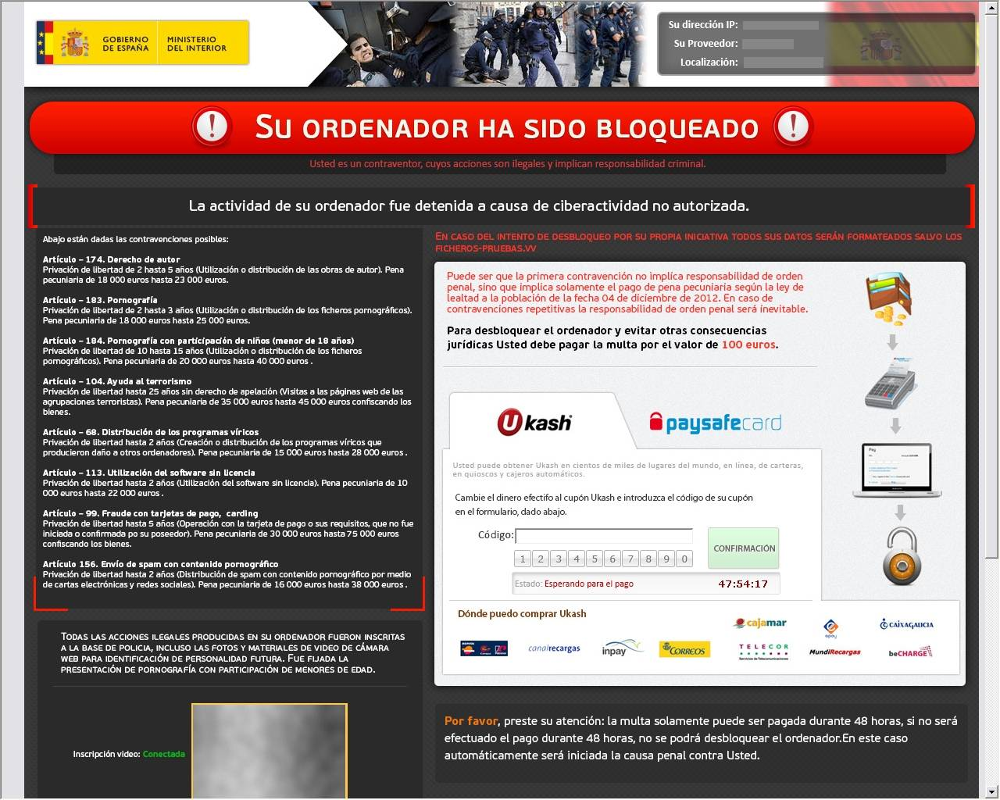
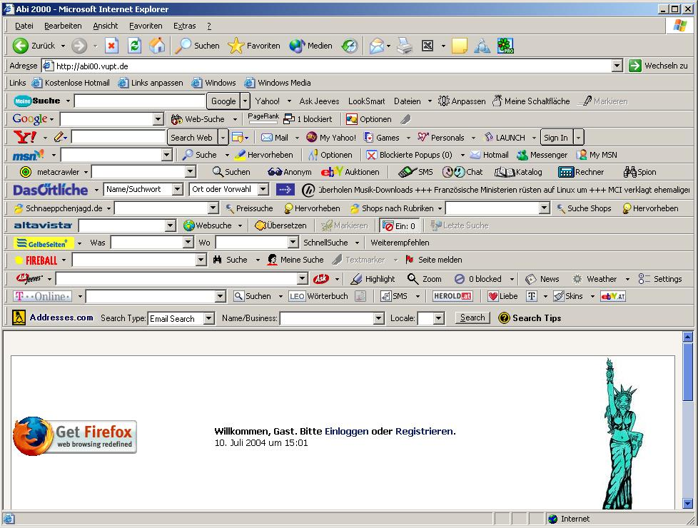

# Amenazas

## Principales amenazas 

En lo referente a la seguridad de nuestros dispositivos debes tener en cuenta la diversidad de amenazas que existen, tales como virus, spywares, troyanos, gusanos y que pueden comprometer tus dispositivos y toda la información que en ellos contengas.

La mayoría de éstos están catalogado como Malware. Un Malware es un tipo de software malicioso con un primer objetivo inicial de infiltrarse en un equipo o sistema informático sin el consentimiento del usuario, para posteriormente actuar sobre él [@WIKI-malware]. 

En este punto es importante que sepas cuáles son todas y cada una de las amenazas a las que estas expuesto, si no tienes las herramientas y no adoptas una actitud prudente en el uso de los dispositivos y la red.

En unidades anteriores viste que precauciones y herramientas debes adoptar para no correr riesgos. En esta unidad verás cuáles son estas amenazas y como llegan a tus dispositivos.

Las amenazas vienen de la mano de perfiles a los que conoces como hacker, ciberdelicuente, pirata informático, etc. Pero cabe destacar que estos conceptos no son lo mismo [@OSPI-ciberseguridad-espana]. Por lo tanto:

- Ciberdelincuentes: Sus ataques se dirigen a objetivos concretos como escuelas, hospitales, instituciones, grandes empresas o bancos, entre muchos otros.

- Ciberterroristas y ciberyihadistas: Varias organizaciones terroristas han desarrollado sus propias divisiones informáticas, aunque todavía no parecen ser capaces de desarrollar ciberataques sofisticados.

- Hackivistas: Grupos reivindicativos que actúan por razones ideológicas.

- Cibervándalos: Simplemente responden al deseo de armar revuelo y suelen ser ciberdelincuentes amateurs y poco cualificados.

Dispones de más información en [hacker vs ciberdelincuente](https://www.incibe.es/aprendeciberseguridad/hacker-vs-ciberdelincuente) y [¿Quiénes son los ciberdelincuentes y qué buscan?](https://www.osi.es/es/campanas/los-ciberdelincuentes-quienes-son/quienes-son-los-ciberdelincuentes-y-que-buscan).

**¿Cómo detectar si estás infectado?**

- Cambios en el navegador, página de inicio distinta, nuevos favoritos o barras de herramientas.

- Ordenador ralentizado.

- Ventanas emergentes inesperadas.

- Perdida de espacio en la memoría ram o disco duro.

- Apagón del equipo de manera inesperada.

- Mensajes anormales a la hora de encender el equipo.

- Mensajes de alertas inesperados.

- Ficheros cambiados de nombre o desaparecidos.
	
**Una buena práctica para minimizar los riesgos es disponer de una suite de seguridad que estaría básicamente formada por:**

- Antivirus.

- Anti-Spyware.

- Firewall o corta fuegos.

- Copia de seguridad.

- Discos de arranque.

- Anti-phishing. El phishing lo verás en esta misma unidad más adelante.

**Si hay menores en casa:**

- Control parental.

- Filtro web (que restringe el acceso a según que contenido, para menores o empresas que no quieren que sus empleados visiten ciertas páginas.)

**Los tres ciberataques que encabezan el ranking son:**

1. Fraude de ventas.

2. Vulnerabilidad de los equipos.

3. Infecciones por malware que pretenden borrar datos, alterar las funciones básicas del equipo, espiar y/o robar datos.

## Virus

Un virus es un programa informático diseñado para infectar archivos u ocasionar efectos molestos, destructivos e incluso irreparables en tu ordenador, dañando hardware, software y archivos [@PANDA-virus].

Los virus tienen diferentes vías de entrada a tus equipos, como por ejemplo: 

- Utilización de una memoria USB previamente infectada.

- Descarga de contenidos mediante redes de compartición P2P, u otras fuentes poco fiables.

- Apertura de algún fichero adjunto en un correo electrónico.

- Al visitar a una web maliciosa y pulsar sobre alguna dirección acortada que se publican en redes sociales y que en realidad no sabes a qué páginas web te puede llevar.
	
## Gusanos informáticos

Los gusanos son en realidad una subclase de virus, por lo que comparten características similares [@PANDA-gusano].

El principal objetivo de los gusanos es propagarse y afectar al mayor número de dispositivos posible, colapsar los ordenadores y las redes informáticas e impidiendo así el trabajo a los usuarios. 

A diferencia de un virus, un gusano no necesita realizar cambios en los archivos de programas, sino que se aloja en diferentes ubicaciones del ordenador, principalmente la memoria RAM, para seguidamente clonarse a sí mismo y usar tus contactos y otros recursos del dispositivo para auto enviarse, a través del correo electrónico o programas P2P entre otros. Por lo que tienen la capacidad de propagarse sin la ayuda de una persona.

Los gusanos tienen diferentes vías de entrada a nuestros equipos, como, por ejemplo: 

- Utilización de una memoria USB previamente infectada.

- Descarga de contenidos mediante redes de compartición P2P u otras fuentes poco fiables.

- Apertura de algún fichero adjunto en un correo electrónico.

- Visitar a una web maliciosa, al pulsar sobre alguna dirección acortada que se publican en redes sociales y que en verdad no sabemos a qué páginas web nos llevarán

## Troyanos

Un Troyano o también llamado Caballo de Troya es una clase de malware que normalmente se camufla como software legítimo. Los ciberladrones utilizan este software malicioso para acceder en tus equipos y una vez dentro campar a sus anchas [@KASPER-troyano].

Uno de los más peligrosos son los Keylogger es un tipo de software o un dispositivo hardware específico que se encarga de registrar las pulsaciones que realizas a través de tu teclado. Posteriormente son guardarlas en un fichero y remitido a través de la red a los ciberdelincuentes.

Pudiendo llegar también como virus o gusanos. Una vez activados, los troyanos pueden permitir a los cibercriminales espiarte, robar tus datos confidenciales y obtener acceso por una puerta trasera a tu sistema.

Los métodos más comunes de infección de un troyano suelen ser:

- La descarga de programas piratas o [crackeados](https://es.wikipedia.org/wiki/Cracking_(software)).

- Descarga de programas gratuitos desconocidos (juegos, salvapantallas y aplicaciones sencillas relacionadas con el entretenimiento).

- Abrir archivos adjuntos infectados.

- Abrir una imagen o cualquier otro tipo de archivo que sea en realidad un ejecutable con extensión modificada.

- Visitar sitios web trampa, es decir, sitios que por ejemplo que podamos ver los vídeos sea necesario descargar un códec que en realidad es el troyano.

- Visitar un sitio web previamente infectado sin las nuestro sistema actualizado o las debidas medidas de seguridad básica correspondiente.

- Descarga de contenidos mediante redes de compartición P2P u otras fuentes poco fiables.

Existen herramientas que analizan y limpian los troyanos que se esconden en tu dispositivo y a su vez previene futuros ataques troyanos. Una de estas herramientas es el [Trojan remover](https://www.avast.com/c-trojan-remover-tool).

## Ransomware o programa rescate

El Programa rescate o ransomware, está dentro del conjunto de software malicioso que también se conoce como malware y que impiden utilizar el equipo mientras el usuario no pague una cierta cantidad de dinero. El virus bloquea o cifra la información o datos del equipo  [@WIKI-ransomware].

Para intimidar y engañar a las víctimas les hacen creer que han incurrido en algún tipo de actividad delictiva, como incitación al odio, terrorismo, pederastia, entre otros. 

Comparte junto con el resto de malware como son los virus, gusanos, troyanos, spyware y demás, la mismas vías de entrada. De modo que puedes verlo en dichos apartados de esta misma unidad.

En la actualidad estos son unos de los ataques más virulentos. Según un estudio realizado por la compañía [Panda Security](https://www.pandasecurity.com/es/mediacenter/seguridad/2019-tsunami-del-ransomware/) en el 2019 este delitito tuvo un incremento con respecto al año 2018 del 500%. Y según un estudio del [Observatorio del Sector Público de Inetum](https://www.ospi.es/es/) solo en 2018, el número de afectados por estos ataques fue de más de 1.000 millones en todo el planeta. 

```{r, echo=FALSE, out.width='75%', fig.align='center', fig.cap='Ransomware (Malware).'}

```

Las diferentes vías de entrada de ransomware a tu equipo son:

- Utilización de una memoria USB previamente infectada.

- Descarga de contenidos mediante redes de compartición P2P, u otras fuentes poco fiables.

- Apertura de algún fichero adjunto en un correo electrónico.

- Al visitar a una web maliciosa y pulsar sobre alguna dirección acortada que se publican en redes sociales y que en realidad no sabes a qué páginas web te puede llevar.

En este punto cabe destacar que la firma de antivirus AVG pone a disposición del usuario una suite de herramientas gratuitas para [deshacer el cifrado del ransomware](https://www.avg.com/es-es/ransomware-decryption-tools).

Además en el caso del sistema operativo de Windows 10 en su última versión dispone de una protección de forma nativa contra ransomware, aunque esto no te garantiza estar inmunizado.

## Spyware o software espía

El spyware es un otro tipo de malware que se mantiene oculto mientras mientras recopila información en secreto, que después transmite a una entidad externa sin el conocimiento o el consentimiento del propietario del dispositivo [@AVAST-spyware].

Puede supervisar y copiar todo lo que escribes, cargas, descargas y almacena. Algunas cepas de spyware también son capaces de activar cámaras y micrófonos sin que te des cuenta.

Un spyware típico se auto instala en el sistema afectado de forma que se ejecuta cada vez que se pone en marcha el ordenador (utilizando CPU y memoria RAM, reduciendo la estabilidad del ordenador), y funciona todo el tiempo, controlando el uso que se hace de Internet e incluso algunos muestran anuncios relacionados.

Sin embargo, a diferencia de los virus, no se intenta replicar en otros ordenadores, por lo que funciona como un parásito.

El spyware tiene diferentes vías de entrada a nuestros equipos, muy parecidas a los virus y gusanos: 

- Descarga de contenidos mediante redes de compartición P2P u otras fuentes poco fiables.

- Apertura de algún fichero adjunto en un correo electrónico.

- Visitar a una web maliciosa, al pulsar sobre alguna dirección acortada que se publican en redes sociales y que en verdad no sabemos a qué páginas web nos llevarán.

## Adware

El Adware también un tipo de software malicioso que te muestra publicidad constante y molesta, bien instalando otro programa o con ventanas emergentes[@AVAST-adware].

Las vías de entrada a son las mismas prácticamente que cualquier otro tipo de malware:

 - Descarga de contenidos mediante redes de compartición P2P u otras fuentes poco fiables.

 - Apertura de algún fichero adjunto en un correo electrónico.

 - Visitar a una web maliciosa, al pulsar sobre alguna dirección acortada que se publican en redes sociales y que en verdad no sabemos a qué páginas web nos llevarán.
 
Aunque parte de toda la molesta publicidad que recibes es legítima, existe una plataforma que se llama [Lista Robinson](https://www.listarobinson.es/) a la que puedes inscribirte e indicar cuales son las  empresas publicitarias de las que no quieres recibir publicidad y por qué medios no quieres recibir dicha publicidad: teléfono, correo postal, correo electrónico o SMS/MMS. Además se trata de un servicio gratuito.
 
Otro software muy útil contra la lucha de la publicidad no deseada es [Ghostery](https://www.ghostery.com/) que se encarga de bloquear anuncios, detener rastreadores y acelerar sitios web. Ghostery descubre los rastreadores que hay tras cada sitio web y te permite controlar lo que no deseas para que tu experiencia de navegación sea más limpia, rápida y segura. 

También es importante saber que prácticamente todos los medios sociales, como Facebook, Instagram, Google y demás disponen en sus menús de configuración de opciones para gestionar la publicidad que llega a tus dispositivos.

## Malvertising     

Malvertising es el acrónimo de las palabras Malicious y Advertising, que en español sería Publicidad Maliciosa. Esta amenaza lo que hace es esconder malware para infectar nuestros dispositivos en los espacios de publicidad de otras páginas webs, como son los banner de publicidad en las cabeceras o laterales tanto izquierdos como derecho de muchas de la web que a diario te encuentras en internet.

La diferencia principal con el adware es que éste primero necesita que el malware se instale en el dispositivo y en el caso del malvertising no es necesaria ninguna instalación por parte del usuario para resultar infectado [@OSI-malvertising].

La vía de contagio por la que podemos caer víctimas de este ciberdelito, es como habrás podido ver es hacer click en los anuncios en páginas webs.

## Scareware o rogueware

Esta variante de malware conocido como scareware o rogueware es otro software malicioso más que trata de engañar a los usuarios para que visiten sitios infestados de malware. Normalmente suele darse en forma de ventanas emergentes, que además aparecen como advertencias legítimas de compañías de software en su mayoría de antivirus y que afirman que el sistema operativo ha sido vulnerado o que los archivos de PC han sido infectado [@KASPER-scareware].

Las vías de contagio son las mismas que has visto en malwares anteriores:

- Descarga de contenidos mediante redes de compartición P2P u otras fuentes poco fiables.

- Apertura de algún fichero adjunto en un correo electrónico.

- Visitar a una web maliciosa, al pulsar sobre alguna dirección acortada que se publican en redes sociales y que en verdad no sabemos a qué páginas web nos llevarán.

## Malware QR

Los Quick Response (QR) son códigos de barra de dos dimensiones diseñados para ser leídos e interpretados rápidamente. Actualmente y sumado a la gran proliferación de smartphones en el mercado, son muy utilizados para publicidades y campañas de marketing. Esto es debido a su gran facilidad de manejo, ya que solo basta con apuntar con la cámara y el smartphone se encarga del resto. 

Lamentablemente los códigos QR también pueden ser utilizados con fines maliciosos, de manera un ciberdelicuente podría usar el código QR para direccionar a los usuarios a páginas web phishing, descarga de malware o cualquier otra amenaza [@ESET-malware-qr]. 

La vía de contagio como te habrás podido dar cuenta queda implícita.

## Phishing

El término Phishing es utilizado para referirse a uno de los métodos más utilizados por delincuentes cibernéticos para estafar y obtener información confidencial de forma fraudulenta como puede ser una contraseña o información detallada sobre tarjetas de crédito u otra información bancaria de la víctima [@INFOSPY-phishing].

El estafador, conocido como phisher, se vale de técnicas de [ingeniería social](https://es.wikipedia.org/wiki/Ingeniería_social_(seguridad_informática)), haciéndose pasar por una persona o empresa de confianza en lo que se conoce como suplantación de identidad o spoofing (término que verás más adelante en esta misma unidad) a través de una aparente comunicación oficial, por lo general un correo electrónico, redes sociales, SMS, etc., a raíz de un malware o incluso utilizando también llamadas telefónicas.

Los medios de phishing más usados por lo ciberdelincuentes:

- Correos electrónicos de carácter corporativo.

- Mensajería instantánea.

- Redes sociales.

- Webs corporativas (Bancos, pasarelas de pago, tiendas online, etc.)

- SMS.

Para poder detectar si estas siendo víctima de uno de estos fraudes debes estar atento a lo siguiente:

- La dirección web o URL: Fíjate muy bien en la URL a la que te remite el enlace que te envían. Insistir en que hay que fijarse muy bien porque en algunas ocasiones las diferencias son inapreciables y se centran incluso en caracteres que se copian o se alteran (una l minúscula por una i mayúscula; un punto situado en un lugar poco visible y otras estrategias).

- Ortografía: Forma en la que está redactado el mensaje. Los ciberatacantes en algunos casos no tienen tu misma nacionalidad ni hablan tu mismalengua y, en muchas ocasiones traducen los textos automáticamente y contienen faltas de ortografía, errores gramaticales o un tratamiento o forma de dirigirse a ti que ninguna comunicación oficial de tu banco, organismos o empresas contendría.

- Cuidado con el remitente y lo que solicitan: Correo electrónico de tu banco, de la Agencia Tributaria, de Amazon u otra empresa. Lo primero que debes mirar es el remitente y comprobar que esa dirección es la que está vinculada a esos servicios. De la misma manera, si el correo te ha llegado a la carpeta de spam ya es un signo inequívoco de que el remitente es sospechoso. ¿Qué te piden en el correo? Ten muy presente que los bancos y las empresas u organismos no reclaman jamás que introduzcas tus datos personales o que los reingreses en una web para reactivar tu cuenta. No lo reclaman jamás.

- Desconfía de los cupones promocionales y las encuestas: Esta modalidad de phishing ha sido una de las que más éxito ha tenido en los últimos años y ha afectado a todas las grandes marcas. Existen ejemplos de phishing a Mercadona, Ikea, a El Corte Inglés, a Zara, a Lidl… Y todo a través de cupones promocionales en los que te prometen una compra o un vale descuento a cambio de que accedas a un enlace y rellenes tus datos personales.

- Descarga archivos adjuntos: Salvo que hayas comprobado todos los pasos anteriores y estés completamente seguro de la identidad del remitente, así como del objeto del mensaje, no descargues documentos adjuntos sin antes pasarlos por un buen antivirus.

- Usa el sentido común y desconfía siempre: Este consejo es válido para detectar el phishing o cualquier otra amenaza en Internet. ¿Quién va a regalar gafas Ray-Ban o a venderlas un 75% por debajo de su precio?.

```{r, echo=FALSE, out.width='75%', fig.align='center', fig.cap='Phishing banco Santander.'}
knitr::include_graphics("images/phishing.jpg")
```

En relación a la protección contra el phishing existen diferentes herramientas y servicios que puedes implementar en tu uso diario de las tecnologías. Algunos de estos son:

- Software anti-phishing: Software especifico para la detección de phishing.

    - [Sophos home](https://home.sophos.com/es-es.aspx).
    
    - [Phishing protection](https://www.phishprotection.com/) 

- Proveedores de email: Estos ofrecen protección contra el phishing a través de filtros y configuraciones con el objetivo detectar y frenar este tipo de fraude llevado a cabo por medio del correo electrónico. Para ello analizan de forma automatizada todos los emails, con el fin detectar links fraudulentos o dominios falsificados que tienen la intención de robar tus datos, protegiendo así a los usuarios de estos tipos de fraudes o estafas online. Esta protección puedes encontrarla prácticamente implementada en la mayoría de gestores de correos actuales.

- Nativas sistema operativo windows: [Anti-phishing defender](https://docs.microsoft.com/es-es/office365/servicedescriptions/office-365-advanced-threat-protection-service-description).

- Antivirus:  Algunos antivirus traen implementado estandares contra el phishing como el [ESET anti-phising](https://support.eset.com/es/kb6380-activar-anti-phishing-en-productos-para-android-de-eset#enable).

- Plugins: Extensiones para el navegador como lo es [ZoneAlarm Web Secure Free](https://www.zonealarm.com/es/anti-phishing/).

- Código anti-phishing: Existen plataformas webs que ofrecen este servicio. Consiste en un código o palabra clave que tú facilitas la primera vez a la web y que ésta incluye en sus futuros email, verificando así la legitimidad del mismo. Un ejemplo de ello lo econtrarás en la plataforma de intercambio de criptomonedas [Binance código anti-phishing](https://academy.binance.com/es/articles/anti-phishing-code).

- Navegadores: 

    - [Firefox](https://www.mozilla.org/es-ES/firefox/) es uno de los navegadores que implementan grandes capas de seguridad siendo una de ellas la protección anti-phishing y que además cuenta con [Mozilla support](https://support.mozilla.org/es/) y [Cómo protegerse del Phishing y del Malware con esta herramienta de Firefox](https://support.mozilla.org/es/kb/como-protegerse-del-phishing-y-del-malware-con-esta-herramienta-firefox).
    
    - [Google Chrome](https://www.google.com/intl/es/chrome/) a su vez cuenta con los recursos ofrecidos por [Google safe browsing](https://safebrowsing.google.com/).

Si quieres saber más sobre como evitar el phishing y de còmo saber identificar este tipo de fraude, visita el enlace de [Cómo identificar un correo electrónico malicioso](https://www.osi.es/es/como-identificar-un-correo-electronico-malicioso).

Otra técnica muy parecida al Phishing e igualmente peligrosa es el Pharming y que consiste en la explotación de una vulnerabilidad en el software de los servidores DNS (Domain Name System) o en el de los equipos de los propios usuarios, que permite a un atacante redirigir un nombre de dominio (domain name) a otra máquina distinta. De esta forma, un usuario que introduzca un determinado nombre de dominio que haya sido redirigido, accederá en su explorador de internet a la página web que el atacante haya especificado para ese nombre de dominio [@KASPER-pharming].

También existe otra amenza silimiar estás conocida como Typosquatting, URL hijacking o fake URL. Está basada en los errores tipográficos cometidos por usuarios de internet cuando introducen la dirección de un sitio web en un navegador. Cuando esto sucede la dirección puede llevarlos a un sitio alternativo propiedad de un cybersquatter [@WIKI-typosquatting].

- Ejemplo: https://wikiepdia.org 
    
## Vishing

El Vishing es una estafa que consiste en una llamada de teléfono en la que ciberdelicuente suplanta la identidad de una persona, empresa o institución para conseguir que le proporciones información privada y sensible. Esta información normalmente van a ser datos personales, contraseñas o peor aun los datos bancarios. Se trata de técnicas de ingeniería social con la que el estafador se va ganando la confianza de la víctima de manera que ésta termina proporcionandole cualquier tipo de datos. Si quieres saber más sobre ingeniería social visita este enlace [¿Sabías que los ataques de ingeniería social suponen el 93% de las brechas de seguridad?](https://www.osi.es/es/actualidad/blog/2019/12/04/sabias-que-los-ataques-de-ingenieria-social-suponen-el-93-de-las-brechas).

Por lo tanto debes tener muy en cuenta, que cualquier petición de tus contraseñas o información financiera es una estafa, ya que las instituciones legítimas nunca te pedirían este tipo de datos tan sensibles a través del teléfono. 

La vía de contagio como se ha señalado al principio es a través de una llamada de teléfono.

## Smishing

El Smishing es un acrónimo formado por las palabras SMS y phishing, debido a su parecido con este ataque tan popular. La diferencia entre el Smishing y el phishing es que mientras que este último lleva a cabo la estafa utilizando el correo electrónico como medio, en el smishing se utilizan mensajes de texto enviados a través de SMS al  smartphone o a través de las distintas aplicaciones de mensajería instantánea.

El modus operandi sigue siendo muy similar a otros ataques donde el ciberdelincuente suplanta la identidad de alguna persona o entidad de confianza para su víctima, con el objetivo de engañarla y conseguir que comparta información personal, realice un pago, haga clic en un enlace malicioso o se descargue un archivo adjunto entre otras.

El mayor riesgo de este tipo de ciberataque es el desconocimiento de los usuarios, ya que no esperan ser engañados a través de un mensaje de texto [@INCI-smishing].

Como se ha destacado en líneas anteriores la vía de entrada de esta amenaza es un MSM.

## Spam o correo malicioso

Los términos spam o correo malicioso hacen referencia a los mensajes no solicitados, no deseados o con remitente no conocido (correo anónimo), habitualmente de tipo publicitario, generalmente son enviados en grandes cantidades (incluso masivas) que perjudican de alguna o varias maneras al receptor [@WIKI-spam].

Su finalidad suele ser con motivos comerciales, pero también pueden contener enlaces peligros como el Phishing, solicitar datos sensibles o contener descargas que sean un riesgo para nuestra privacidad y seguridad: 

- E-Mails Spam con fines comerciales

- Envíos masivos / Avisos de virus

- E-Mails con ofertas o regalos
 
- Correos Phishing

Si recibes un email de carácter sospechoso, no lo abras y márcalo directamente como spam, para que así tu gestor de correos lo identifique para los sucesivos.

En este caso no hace falta destacar que este molesto malware llega por medio de gestores de correos.

## Toolbars

Las Toolbars son barras de herramientas que aparecen en la parte superior de los navegadores. Generalmente sirven para tener enlaces más rápidos a servicios, por ejemplo Windows Live Toolbars da acceso al correo y búsqueda entre otras funcionalidades. Regularmente los navegadores tienen las suyas propias.
 
Pero puede ocurrir que a través de una instalación de software, normalmente gratuito puedan ser instaladas. Debes tener en cuenta que algunas de estas son muy molestas y en algunos casos pueden llegar a bombardearte con publicidad no deseada y que además en ocasiones llegan a ser muy difíciles de eliminar. Aunque cada vez son memos frecuentes.

```{r, echo=FALSE, out.width='75%', fig.align='center', fig.cap='Toolbar.'}

```

Normalmente, se instalan como un añadido al instalar aplicaciones gratuitas en el ordenador. Si no tienes cuidado durante el proceso de instalación y pulsamos siempre "Siguiente-Siguiente-Siguiente" las toolbars acaban en nuestro navegador. Para evitarlo no debes instalar una aplicación dando a "Siguiente-Siguiente-Siguiente" sin leer lo que nos están indicando. Para evitar este supuesto, recuerda que lo mejor es descargar programas solo de las webs oficiales.

En el caso de haber instalado alguna toolbars por descuido existen algunas herramientas para desinstalarlas fácilmente, entre ellas esta [Malwarebytes](https://es.malwarebytes.com/adwcleaner/).

Como se ha señalada más arriba la vía de contagio suele ser la instalación de software normalmente gratuito.

## Usurpacion o robo de identidad 

El robo de identidad, usurpación de identidad es la apropiación de la identidad de una persona: hacerse pasar por esa persona, asumir su identidad ante otras personas en público o en privado, en general para acceder a ciertos recursos o la obtención de créditos y otros beneficios en nombre de esa persona. Esto que sucede en el mundo analógico también ocurre en el mundo digital [@WIKI-usurpacion].

La manera que tienen los ciberdelincuentes de usurpar la identidad suele ser a través de los siguientes:

- Robo masivo de cuentas de email por medio de métodos de hacking.

- Por medio de Phishing, Smishing o Vishing.

- Dejando tú cuenta abierta en sitios públicos.

- Usando Wi-Fi de terceros creadas para ese fin.

- Software espía o troyanos.

La usurpación de identidad permite a los delincuentes hacerse con información personal de sus víctimas, para luego con ella interceptar aún más datos de otros perfiles, a quienes engañan con el fin de extorsionar u obtener lucro económico e incluso a veces realizar actividades delictivas.
En caso de ser víctima de esta amenaza debes tener en cuenta lo siguiente:

- Guarda los mensajes de texto e emails que recibas.

- Haz capturas de pantalla.

- Revisa todas tus redes sociales.

- Avisa a tus contactos sobre el perfil falso.

- Infórmalo dentro de la aplicación. Todas las plataformas y redes sociales disponen de un apartado de Suplantación de indentidad en las cuentas.

- Si es de carácter grave denúncialo a las autoridades.

- Si es posible cancela cuenta.

En la [Oficina de seguridad del internauta](https://www.osi.es/es) tienes una publicación que se llama [¡Me han secuestrado mi cuenta!](https://www.osi.es/es/actualidad/historias-reales/2021/03/05/me-han-secuestrado-mi-cuenta) de una historia real donde puedes ver como gestionar este tipo de ataques.

## Spoofing o suplantación de identidad     

Normalmente cuando un ciberdelincuente usurpa un cuenta, ya sea particular o corporativa, la principal intención es hacer uso del spoofing o también conocido como suplantación de identidad. Estos términos pueden confundirse con el Phishing, pero no son lo mismo. Podría decirse que el Phishing es el término o palabra que se utiliza para describir la manera con la que los estafadores se hacen con tus datos y el spoofing son las herramientas, procedimientos o técnicas con los que lo lleva a cabo. Ejemplo: Un ciberestafador suplanta la web o el correo que recibes de tu entidad bancaria para que facilites tus datos, esta es la herramienta o herramientas y el término o nombre que recibe este acto es el Phishing. No obstante en el siguiente enlace puedes obtener más información sobre las [diferencias entre Phishing y Spoofing](https://techlandia.com/diferencia-phishing-spoofing-info_241711/).

A tener en cuenta también el hecho, que el uso de una acreditación física que no pertenece a su legítimo dueño, también esta considerado una estafa. Un claro ejemplo es el uso que hace un tercero de una tarjeta de identificación robada, para obtener el acceso a un determinado departamento físico de una compañía o empresa. Esto es lo que se conoce como [Masquerating o suplantación de indentidad física](https://moodle2019-20.ua.es/moodle/pluginfile.php/113537/mod_resource/content/8/tema/4masquerading_mascarada.html#:~:text=Consiste%20en%20suplantar%20la%20identidad,le%20pertenecen%20o%20en%20persona.).

Otra actividad relacionada con la usurpación de identidad es el Brushing. Este delito es el que realizan algunos vendedores de Internet, que envían paquetes con objetos muy pequeños a diferentes usuarios para hacerse pasar por ellos y después poder valorar sus propios productos. Aunque en cierto modo esto no te pone en un serio riesgo, conviene conocerlo por si te sucede saber que se trata de una suplantación de la identidad y que es aconsejable interponer una denuncia [@brushing].

La manera que tienen los ciberdelincuentes de suplantar la identidad suele ser la misma que tienen para usurpar o robar la identidad:

- Robo masivo de cuentas de email por medio de métodos de hacking.

- Por medio de Phishing, Smishing o Vishing.

- Dejando tú cuenta abierta en sitios públicos.

- Usando Wi-Fi de terceros creadas para ese fin.

- Software espía o troyanos.

## Ciberestafas en compras online y otros engaños

Llegados hasta aquí, recordarte que todas las precauciones que se detallan en este manual en el apartado de Compras y transacciones de la unidad de Gestión de la seguridad en la red, son altamente recomendable en este punto. Además de ser fuertemente aconsegable seguir todas esas indicaciones, también se trata de tener en cuenta el conjunto de requisitos que veras a continuación, ya que cada uno de ellos por independiente te va a garantizar una capa más de seguridad y te irán indicando si puede o no puede ser una estafa.

Requisitos a comprobar:

- Formato seguro de URL: Https con su correspondiente candado.

- Certificado de seguridad: Certifica que no ha sido vulnerada ni hackeada.

- Sello de confianza y autenticidad: Verifican que se trata de una web legítima y confiable.

- Conocer la empresa detrás de esa web, su ubicación, política de envío y de devolución, etc.

- El precio que suele ser muy por debajo o simplemente con un descuento muy suculento.

- Sorteos ganados bajo cualquier pretexto: Eres el visitante número 1.000 por ello te has ganado un premio.

Además puedes visitar la siguiente entrada donde aprenderás [cómo detectar fraudes y análisis de una web falsa](https://www.osi.es/es/actualidad/blog/2018/08/08/detectando-fraudes-analisis-de-una-web-de-venta-falsa).

Las estafas online no solo te las vas a encontrar en la compra de productos o servicios, sino que también en diferentes escenarios como los que verás a continuación. Pudiendo encontarlos a través de correos electrónicos, webs de venta de segunda mano, en webs maliciosas, etc.

Algunos ejemplos de estafas son:

- Timo Nigeriano: Lotería, viuda, enfermo terminal, herencias, etc.

- Falsas ofertas de empleo: Ofertas de empleo bajo pago previo.

- Falsos prestamistas de dinero: Que después de pagar los costes luego no recibes.

- Novias rusas: Embaucan para posteriormente pedir dinero.

- Falsos correos de sextorsión: Simulan que tienen fotos o vídeos comprometidos, cuando no es así.

- Propuesta de compra del producto que tienes en venta: Solicitando que hagas el pago del envío por adelantado.

- Pedir que hagas el pago o contactar contigo fuera de la plataforma de venta.

- Otras muchas y nuevas que van ingeniando.

Las vías de entrada de las ciberestafas suelen llegar por medio:

- Correos electrónicos.

- Plataformas de venta de segunda mano.

- Web de venta fraudulentas.

En esta [Guía de fraudes online](https://www.osi.es/es/guia-fraudes-online) tienes un amplio catálogo de recursos para detectar si estas siendo víctima de una estafa o fraude online.

Por último pero no por ello menos importante si en algún momento te encontrases ante una posible estafa debes reportarlo a través desde este enlace para [reportar webs fraudulenta en el Incibe](https://www.incibe.es/protege-tu-empresa/reporte-fraude).

## Vulnerabilidades

Una vulnerabilidad en términos de informática es una debilidad o fallo en un sistema de información que pone en riesgo la seguridad de la información pudiendo permitir que un atacante pueda comprometer la integridad, disponibilidad o confidencialidad de la misma. Estas vulnerabilidades pueden tener distintos orígenes como por ejemplo: fallos de diseño, errores de configuración o carencias de procedimientos [@INCI-vulnerabilidad].

Los fallos de vulnerabilidad les corresponde corregirlos a las terceras partes implicadas lo a veces con lleva la dificultad de que escapan a nuestro control. Pero para protegernos de tales, debemos tener actualizados todos nuestros sistemas y software. 

Un ejemplo de vulnerabilidad muy conocido fuero el [Meltdown](https://es.wikipedia.org/wiki/Meltdown_(vulnerabilidad)) y [Spectre](https://es.wikipedia.org/wiki/Spectre_(vulnerabilidad)), relacionadas con los procesadores informáticos, que existen desde mediados de los noventa, pero que han sido descubiertas solamente ahora.

## Cryptojacking

El cryptojacking, también llamado minería de criptomonedas malicioso, consiste en un tipo de software fraudulento que se oculta en un ordenador o en un dispositivo móvil, y utiliza los recursos de la máquina para extraer diversas formas de monedas digitales conocidas como [criptomonedas](https://es.wikipedia.org/wiki/Criptomoneda). Hay que aclarar que no está tan focalizado en el robo directo de estas, sino, que se centra en el robo o secuestro de dispositivos de terceros con el fin de utilizarlos para minar estas criptomonedas, y a los que se le conocen también como dispositivos zombies [@cryptojacking].

Se trata de una amenaza reciente que se hace con el control del navegadores web, y de este modo, comprometen todo tipo de dispositivos, desde ordenadores de escritorio y portátiles hasta teléfonos inteligentes e incluso servidores de red.

Existen recursos y herramientas para saber si estamos siendo víctimas de cryptojacking [@GEN-guia-cryptojacking]:

- Te puede pasar que el ordenador se recaliente, que empiecen a sonar los ventiladores de pronto y se mantengan encendidos por más tiempo de lo que consideras normal.

- El sistema operativo se pondrá lento, incluso se puede llegar a colgar el navegador o todo el sistema constantemente.

- Comprueba el administrador de tareas en Windows, o el Monitor de actividad en MacOS. Fíjate en los procesos que estén ocupando el mayor porcentaje de CPU. En circunstancias normales un solo proceso no debe pasar de 10%, rara vez sobrepasan el 20% al menos que se trate de software muy complejo como el de edición de vídeo, juegos, o el mismo sistema actualizando. Pero que te aparezca el navegador en números absurdos como 70-90 y hasta 100% es una alarma clara.

Las vías de contagios son las mismas que la mayoría de malware tales como los virus, gusanos, troyanos, spyware y demás. Por lo que puedes verlo en dichos apartados de esta misma unidad. Aunque en la mayoría de los casos te llegará a través de una web, haciendo uso del navegador. Es por ello que existen webs y plugin que comprueban si estas siendo víctima de este ciberdelito e incluso alguna de estas herramientas previenen y bloquean estos ataques. A continuación tienes una lista para que puedas elegir la que mejor se adapte a tus necesidades:

- [CoinEater](https://github.com/fhstp/CoinEater) 

- [Minerblock](https://github.com/xd4rker/MinerBlock)

- [Not mining](https://notmining.es)

- [NoCoin](https://github.com/keraf/NoCoin)

- [NoMiner](https://chrome.google.com/webstore/detail/nominer-block-coin-miners/jfnangjojcioomickmmnfmiadkfhcdmd)

- [Adblock nocoin list](https://github.com/hoshsadiq/adblock-nocoin-list)

Señalar que [Microsoft Defender](https://www.microsoft.com/es-es/windows/comprehensive-security), que como ya sabréis es el antivirus que Windows trae por defecto ya incluye [protección contra el cryptojacking](https://www.microsoft.com/security/blog/2021/04/26/defending-against-cryptojacking-with-microsoft-defender-for-endpoint-and-intel-tdt/), aunque de momento solo está presente en la versión empresarial, es de suponer que con el paso del tiempo lo terminen incluyendo en las versiones de Windows Home.

## Plugins maliciosos

En primer lugar, es importante tener claro qué es un plugin. Así pues, se trata de un software o aplicación que actúa como complemento para ampliar las funcionalidades del programa principal al que complementa. Dicho esto, algunos ciberdelicuentes usan esta funcionalidad para sus actividades delictivas, como espiar o recopilar datos sensibles e incluso el robo de criptomonedas. [@IONOS-plugin].

Instalar un plugin suele ser una acción muy sencilla, y te puede servir para finalidades muy diversas, un claro ejemplo ello, es el plugin de [Google drive](https://drive.googleblog.com/2012/12/introducing-save-to-drive-extension.html) o [Adblock](https://getadblock.com/) para el bloqueo de publicidad, etc. Es por esto que debes tener siempre algunas consideraciones, como verás a continuación.

Sin embargo, a pesar de ser programas muy útiles que la inmensa mayoría utiliza, no todos son conscientes del riesgo que conlleva el simple hecho de instalar un plugin. El problema suele venir por no tener actualizado un buen sistema de seguridad.

A veces, el simple hecho de que el plugin este disponible no significa garantía ninguna. Tanto es así que aquí podemos ver uno de los que recientemente ha sido retirado de WordPress hasta en cuatro ocasiones. Un programa capaz de recopilar datos de los navegantes con el correspondiente riesgo a nivel de Reglamento General de Protección de Datos que esto conlleva, así como de publicar entradas no deseadas y prácticas de spam. De otra lado Google esta continuamente retirando plugins maliciosos de su plataforma.

El contagio de estos plugins maliciosos normalmente es a través de las Webs Store de las diferentes plataformas. Por lo que los puntos más importantes a tener en cuenta a la hora de protegernos son:

- Infórmate del desarrollo del plugin así como posibles variaciones.

- No descarges plugins sospechosos.

- Utiliza preferiblemente aquellos plugins de referencia, con fama y garantía reconocidas.

## SIM Swaping

El SIM swapping,es la técnica que usan últimamente los ladrones digitales que se basa en duplicar la tarjeta SIM del móvil de sus víctimas. Así, pueden acceder a toda su información personal y, sobre todo, pueden usarlas en la verificación a través de un SMS por medio del móvil que suelen pedir los bancos cuando se opera a través de Internet y algunas otras plataformas online.

Por ello, aunque la mayoría de las apps de los bancos son muy seguras, con protocolos complejos para las claves de acceso, cifrado de las comunicaciones y teclados virtuales, los timadores digitales son capaces de saltarse la seguridad por medio de una técnica llamada [ingeniería social](https://es.wikipedia.org/wiki/Ingeniería_social_(seguridad_informática)), que consiste en el engaño a través de técnicas de persuasión y manipulación psicológica. Sin embargo, en lugar de timar directamente a las víctimas, el SIM swapping se consigue por medio de un engaño a los dependientes de las tiendas de telefonía.

Por lo tanto, una vez que el ciberdelicuente se hace con tus credenciales del tipo que sea, tales como contraseñas bancarias o de perfiles sociales, como Facebook, Instagram, etc o cualquier otra credencial privada, no va a tener problemas para obtener el SMS de verificación.

Cabe destacar que cuando se es víctima de este asalto digital, al obtener la duplicación de la SIM por parte del atacante, tu tarjeta queda sin uso, por lo tanto pierdes la cobertura de llamadas y la conexión de internet [@PANDA-sim].

Por lo tanto, es importante que sigas estas recomendaciones para no ser víctimas del SIM Swapping:

- Utiliza una contraseña adicional o [doble autentificación](https://www.osi.es/es/actualidad/blog/2019/02/27/el-factor-de-autenticacion-doble-y-multiple): reconocimiento facial, por voz, PIN adicional, [Google authenticator](https://play.google.com/store/apps/details?id=com.google.android.apps.authenticator2&hl=es&gl=US), etc.

- No compartas demasiada información en Internet. Cuantos más datos haya sobre ti en la web, más fácil será para los malos chantajearte, timarte o conseguir otras cosas tuyas, como contraseñas, cuentas bancarias, etc.

- No almacenes todo en tu móvil, no es una caja fuerte. Es un dispositivo electrónico que no es 100% seguro.

- Exige a tu operador móvil que refuerce sus sistemas de seguridad cuando se trate de operaciones en tu nombre.

- Los mensajes a través de aplicaciones de mensajería tipo WhatsApp, Telegram, Line, etc. son más seguros que los SMS, ya que están encriptados y éstos últimos no, haciéndolos más susceptibles.

- No vincules tus cuentas bancarias a tu cuenta o teléfono.

- No le des nunca a nadie tu código PIN. ¡Nunca!.

- Instala un antivirus o solución de seguridad para evitar que puedan robar o acceder a tus datos personales.

Desde el [Instituto nacional de Ciberseguridad](https://www.incibe.es/) y a través de este [video](https://www.youtube.com/watch?v=fIaodow_nxw) podrás obtener más información sobre que es el SIM Swaping.

## Shoulder surfing o visual hackins

El shoulder surfing o también conocido como visual hackins es una técnica en apariencia muy sencilla empleada por los ciberatacantes con el objetivo de conseguir información de un usuario en concreto. Esta técnica consiste en mirar literalmente por encima del hombro y que suele llevarse a cabo mientras viajamos en metro, en autobús o en cualquier sitio público donde los cibervándalos puedan estar atento al uso que haces de tu dispositivo sin que puedas percatarte de ello [@OSI-shoulder-surfing]. 

Como has podido leer, evitar el uso de datos sensibles en espacios públicos es la mejor fórmula para evitar caer en este tipo de amenazas.

## Ciberacoso

El ciberacoso es una forma de acoso o intimidación por medio de las tecnologías digitales. Su modus operandi se realiza en las redes sociales, las plataformas de mensajería, las plataformas de juegos, smartphones y cualquier otro dispositivo, plataforma o medio que disponga de conexión a internet. Es un comportamiento que se repite y que busca atemorizar, enfadar, humillar o maltratar a otras personas. 

Ejemplos de ciberacoso son:

- Difundir mentiras o publicar fotografías vergonzosas de alguien en las redes sociales.

- Enviar mensajes hirientes o amenazas a través de las plataformas de mensajería.

- Hacerse pasar por otra persona y enviar mensajes agresivos en nombre de dicha persona.

El acoso cara a cara y el ciberacoso ocurren juntos a menudo. Pero el ciberacoso deja una huella digital, lo cual quiere decir, que queda un registro que puede servir de prueba para ayudar a detener el abuso [@ciberacoso].

## Ciberextorsión

La ciberextorsión es una forma de chantaje que sufre la víctima a través de los medios digitales, mediante el cual se le fuerza u obliga a pagar o a realizar algún acto o actividad delictiva o no lícita, para evitar los términos del chantaje. Un caso muy común es el del malware Ransomware que te obliga a pagar una cantidad de dinero si quieres recuperar tus archivos.

La plataforma de antivirus Panda Security pone a tu disposición una [Guía de ciberextorsión](https://www.pandasecurity.com/es/mediacenter/src/uploads/2016/02/Guia_Ciberextorsion-es.pdf) para que puedas documentarte con más amplitud.

Dentro de la ciberextorsión se encuentra lo que se conoce como sextorsión. Este ciberdelito es también de una forma de extorsión en el plano digital, pero en este caso con contenido sexual. En la sextorsión la víctima es amenazada con la supuesta publicación y difusión de contenido sexual. 

## Baiting 

Para llevar a cabo el baiting los ciberdelincuente suelen utilizar dispositivos de almacenamiento extraíbles, normalmente memorias USB o incluso CDsy DVDs infectados con un software malicioso para posteriormente dejarlos en un lugar en el cual sea fácil de encontrar por la víctima como por ejemplo, baños públicos, ascensores, aceras, etc. Cuando la víctima encuentre dicho dispositivo y lo introduzca en su ordenador, el software malicioso se ejecutará de manera inadvertida y posibilitará que el hacker pueda acceder a los datos del usuario o usuaria [@baiting].

La vía de contagio como te habrás podido dar cuenta queda implícita.

## Clickjacking

El clickjacking busca usuarios desprevenidos que hagan clic en algún botón, pestaña o accedan a un enlace mientras navegan por internet, haciendoles creer que están ante algo legítimo y positivo para ellos. Suelen ser ganchos tales como, una oferta muy ventajosa o algo que provoque en la víctima la necesidad de entrar e informarse y de esta modo quedar infectado [@WIKI-clickjacking].

## Dumpster diving o scavening

Este ciberdelito se conoce como el proceso de buscar en tu basura para obtener información útil sobre ti o tu empresa que luego pueda ser utilizada en tu contra. Aunque este tipo de ataques esta más bien dirigido a empresas, debes tener cuidado con la información que desechas por el método de tirarlo a la basura. Nunca se sabe lo que los cibercacos están dispuestos a hacer [@WIKI-dumpster-diving].

Cuando te deshagas del algún dispositivo físico de almacenamiento, ya sea un disco duro externo, un PC, un USB o cualquier otro dispositivo, asegúrate primero de eliminar totalmente todo el contenido. Para ello utiliza software de borrado definitivo, ya que un simple formateado no eliminará la información. El borrado solo se completa cuando se reescribe sobre la anterior información, es por esto que un formatero solo te hace constar que el espacio esta disponible, pero el contenido sigue estando ahí aunque oculto. Esto quiere decir que con software avanzado y específico los ciberdelincuentes podrían recuperar todo el contenido [@borrado-almacenamiento].

Algunas herramientas de borrado definitivo son:

- [Eraser](https://eraser.heidi.ie/).

- [Disk wipe](https://www.diskwipe.org/download.php).

Para evitar este tipo de amenaza ya sabes, ten cuidado con lo que tiras a la basura.

## Quid pro quo

Según el diccionario de la lengua española el término "quid pro quo" es una locución latina que significa, cosa que sustituye a algo equivalente o que se recibe como compensación por ello. Sabiendo esto, el ciberdelincuente que emplea esta técnica, promete a su víctima un beneficio a cambio de información personal. Este beneficio suele ser compensaciones en formato regalo, como pueda ser merchandising, dinero, acceso gratuito a programas de pago, ayuda en servicio técnico, etc. Normalmente este ciberdelito te llegará a través de llamadas telefónicas o mensajes de supuestos expertos que ofrecen este tipo de compensaciones sin coste alguno [@quid-pro-quo].

Las vías de contagio se han señalado más arriba y son las llamadas de teléfono o los mensajes con independencia de la naturaleza de estos.

## Formjacking

El formjacking es la técnica que utilizan los ciberdelincuentes para interceptar la información que pones al comprar por Internet. Cuando entras en una página y realizas un pago, tienes que introducir los datos de tu tarjeta bancaria y esa es la información que busca el ciberestafador.

Esto lo llevan a cabo secuestrando los sitios webs donde habitualmente compran los usuarios. De esta forma la información que se introduce va a parar a un servidor controlado por ciberdelicuentes a través de lo que se conoce como la técnica de inyección de código malicioso, pudiendo así, robar información de pagos, número de la tarjeta o cualquier otro tipo de datos sensibles.

Es por ello que es muy recomendable evitar las páginas que puedan ser vistas como vulnerables, ya que éstas van a ser la vía de contagio. Aunque esto pueda parecer difícil de detectar, si ves una web con una estética un tanto antigua es posible que el resto de la web también este algo obsoleta y sea el objetivo de este ciberdelito [@formjacking].

## Juice jacking

Practicamente todo el mundo en algún momento se ha quedado sin carga en algunos de sus dispositivos, pero gracias a que existen multitud de cargadores de USB públicos, esto ya no es un problema. Pero detrás de los beneficios que esta práctica nos aporta, se esconde una amenaza que va proliferando cada vez más llamada juice jacking. El juice jacking consiste en alterar con fines maliciosos la fuente de carga de los USBs por parte de los diberdelincuentes y que a través de esta técnica pueden aprovecharse tanto para el robo datos como para la inyección de archivos [@ESET-juice-jacking].

La vía de contagio de esta ciberamenaza queda evidente en lo anteriormente expuesto, por lo que intenta evitar en la medida de lo posible usar cargadores públicos.

## Sustracción o perdida

Otra contingencia con la que te puedes encontrar es el robo o perdida de tu dispositivo. Si te encontrases ante esta posibilidad, a continuación tienes esta lista de todo lo que debes hacer para minimizar males mayores.

Qué hacer en caso de que hayas extraviado o te hayan robado tu dispositivo móvil:

- Pide a tu operadora que bloquee el IMEI de tu teléfono.

- Búscalo con el localizador para [android](https://myaccount.google.com/intro/find-your-phone?hl=es-ES) para [apple](https://www.apple.com/es/icloud/find-my/).

- Anula la SIM y pide duplicado de la misma.

- Cambia todas tus contraseñas. ¡Todas!.

- Denúncialo a la Policía.

- Denúncialo a tu operadora

- Avisa a tus contactos. Sí, a todos.

- Bloquea el dispositivo y borra el contenido que puedas de forma remota.

- Comprueba tu cuenta bancaria y ponte en contacto con tu banco.

Además de contar con los localizadores nativos de android y apple, en el siguiente enlace encontrarás otras apps para que puedas elegir la app que más te guste para [localizar tu dispositivo móvil](https://www.osi.es/es/herramientas-gratuitas?herramienta_selec%5B0%5D=122).
